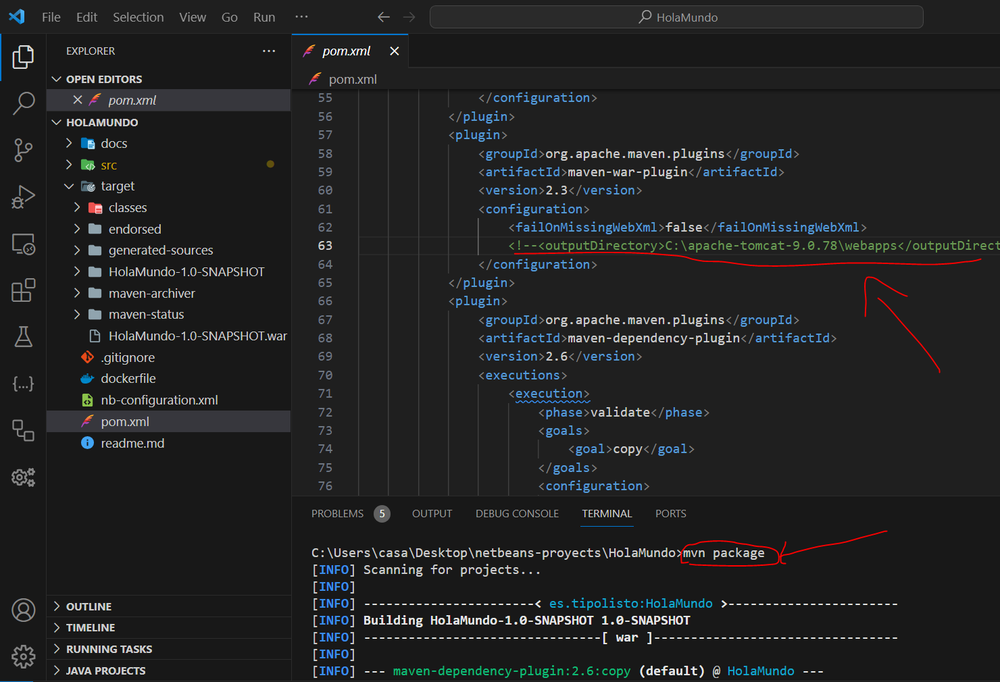
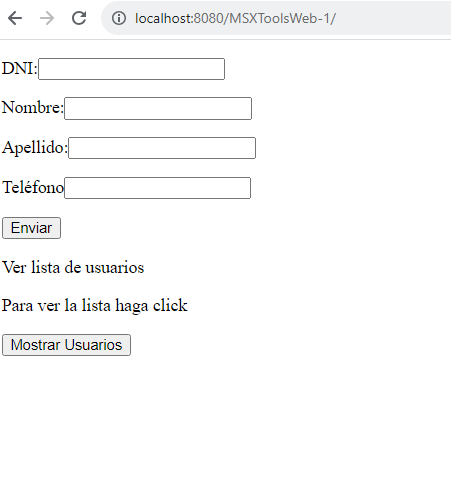

# Dependencias

java 1.8
maven 3.0
Apache tomcat 9
java EE web 8

# Prueba online

https://msxtoolsweb.onrender.com/MSXToolsWeb/

Servidor utilizado: https://render.com/

Dashboard: https://dashboard.render.com/

# development

Cuando hayas descargado el código, abre una terminal y escribe "mvn package" para que genere el war:

Ahora tendrás que dárle el war generado al servidor de servlets java como tomcat o glasfish, puedes copiar y pegar el war "HolaMundo-1.0-SNAPSHOT.war" o poner dentro del pong.xml en la etiqueta outputDirectory dentro del maven-war-pluging "<outputDirectory>C:\apache-tomcat-9.0.78\webapps</outputDirectory>", esto hará que el war se ponga en la carpeta wepapp del servidor, arranca el servidor. Ahora escribe en un navegador web: "http://localhost:8080/MSXToolsWeb-1/":

